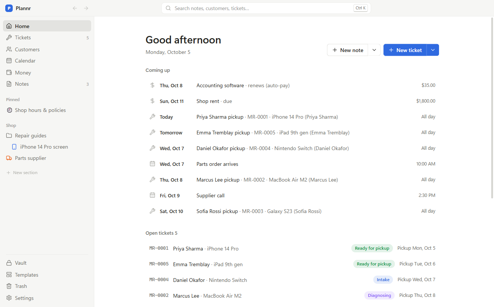
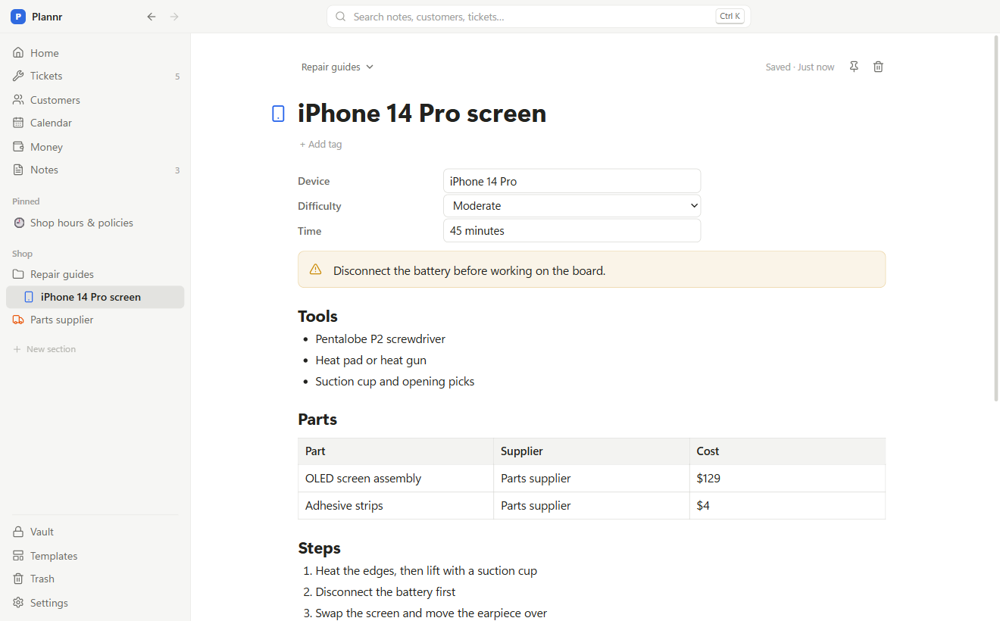
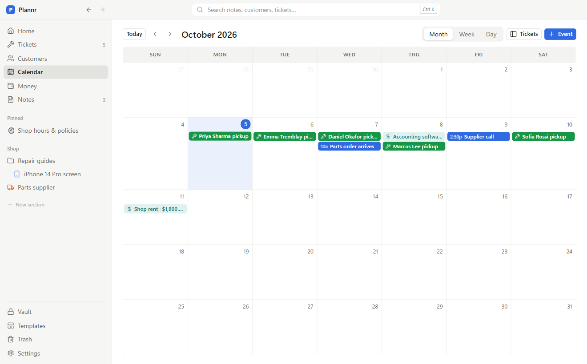
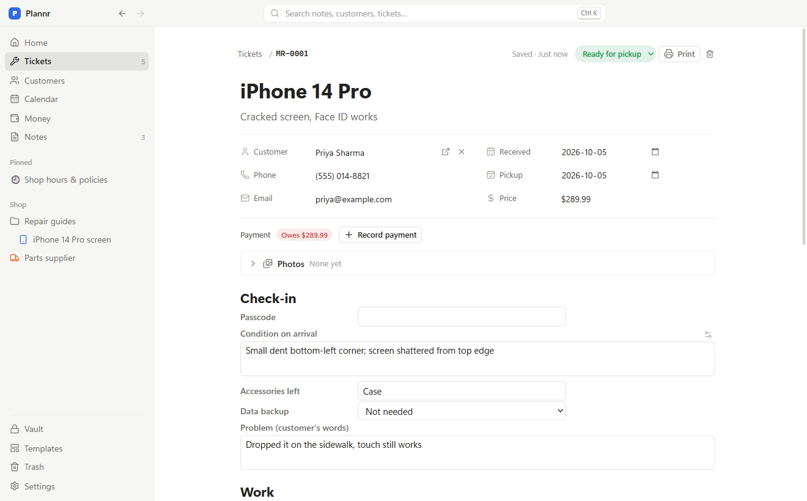
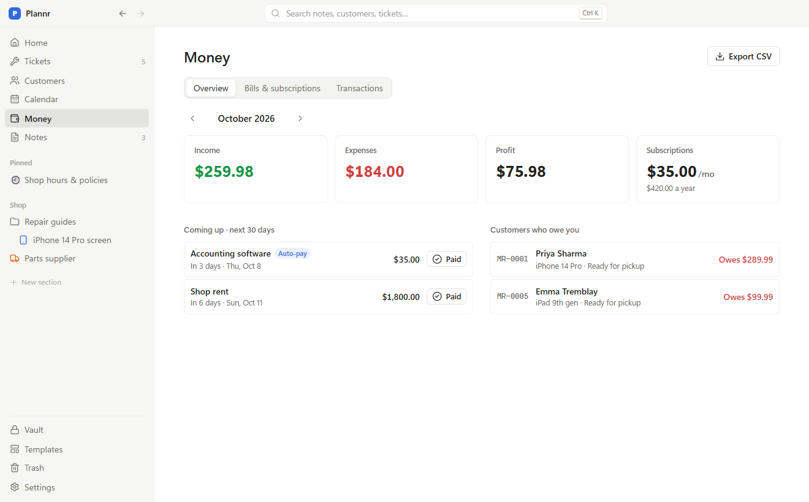
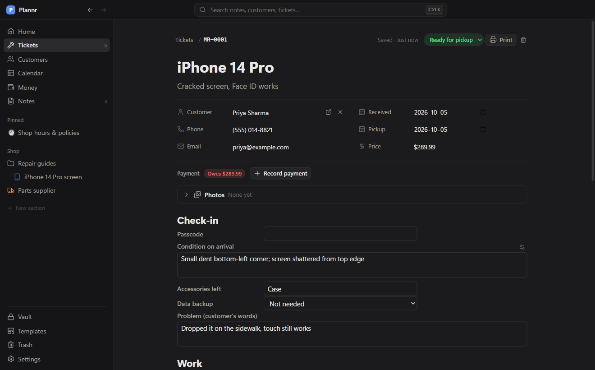
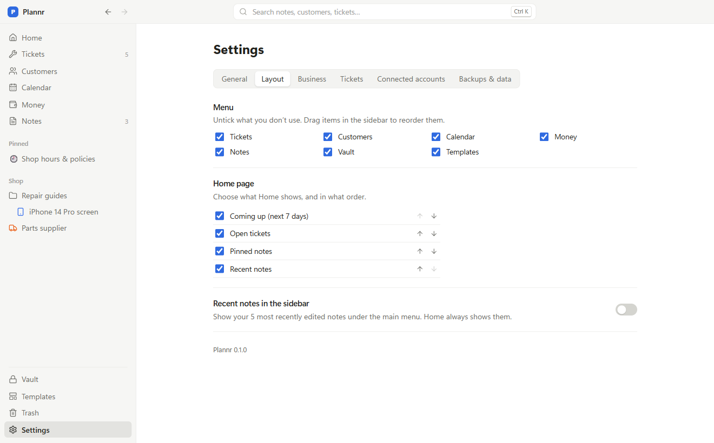

# Plannr

**A free, open-source organizer for Windows.** Notes, a calendar, customers, jobs and tickets, money and a locked vault in one calm window. Everything stays on your computer.

[**⬇ Download for Windows**](https://github.com/GLr-P/plannr/releases/latest) · [Website](https://glr-p.github.io/plannr/) · Open source (GPL-3.0)



Plannr started as the one app a small business owner wanted instead of five: somewhere to write things down, see the week ahead, keep track of people and work in progress, and know where the money went. It works just as well for freelancers, side projects, a household, or anyone who wants their stuff in one place.

## What's inside

| | |
|---|---|
| **Notes** | A clean editor with checklists, tables, callouts, toggles and photos. `@` links notes, customers and tickets together, and the other side shows the link back. Folders, your own sidebar sections, icons and colours. Seven starter templates (meeting notes, checklist, weekly plan, daily log, inventory, supplier, how-to guide). |
| **Calendar** | Month, week and day views. Drag notes and tickets onto a day. Reminders pop up in Windows. Public holidays included. |
| **Customers** | The people and companies you work with: their details and everything you've done for them. Search by name, email or phone number in any format. |
| **Tickets** | Track jobs, repairs, orders or requests from start to finish: status, pickup date, price, photos and a fill-in form from a template you design. Print a slip, a receipt or a label. Rename the statuses to fit your work. |
| **Money** | Income (tax included, tax on top, or no tax), expenses, bills and subscriptions with auto-pay, who still owes you, and monthly totals. CSV export. |
| **Vault** | Passwords, cards and documents, encrypted with your own passcode (AES-256). Locks itself when you step away. |

Don't need some of it? Untick it during the welcome tour (or later in Settings) and it leaves the menu.

Optional connections, if you use them:

- **Google Calendar**: your Plannr events on your phone, and your Google calendars inside Plannr
- **Zoho Mail**: every email with a customer, right on their page
- **QuickBooks Online**: customers, payments and expenses sent to your books automatically

Each connection uses your own free developer key, so your data goes straight from your computer to the service. Settings has step-by-step instructions.

## Screenshots

| | |
|---|---|
|  |  |
|  |  |
|  |  |

## Make it yours

Light or dark, 8 accent colours, compact spacing and bigger text. Drag the menu into any order, hide what you don't use, and choose what Home shows. Name your own sidebar sections, and give notes and folders icons and colours. Pick your own ticket numbers, status names, currency and payment methods.

## Install

1. Download **Plannr-Setup-x.y.z.exe** from the [latest release](https://github.com/GLr-P/plannr/releases/latest).
2. Run it. Plannr isn't code-signed (signing costs money every year, and Plannr is free), so Windows may say *"Windows protected your PC"*: click **More info → Run anyway**.
   If Windows instead says it **blocked** Plannr, your PC has **Smart App Control** on, which doesn't allow unsigned apps at all. To use Plannr you'd need to turn it off: Windows Security → App & browser control → Smart App Control settings → Off. Note that Windows can't turn Smart App Control back on without resetting the PC, so decide whether that's worth it for you.
3. Plannr opens with a one-minute welcome tour.

Plannr updates itself: when a new version is out, an **Update** button appears at the top of the window (or use Settings → General → Check for updates).

Works on Windows 10 and 11 (64-bit). Your data lives in `%APPDATA%\Plannr\data`, and Plannr backs it up every day to `Documents\Plannr Backups` (you can change the folder or restore a backup in Settings). Uninstalling keeps your data.

## Privacy

Plannr has no account, no server and no tracking, and it never sends your notes, contacts or other data anywhere unless you ask it to. Your data stays in `%APPDATA%\Plannr\data` on your computer.

It makes two automatic connections, neither of which sends any of your data, and you can turn both off:

- **Update check:** it asks GitHub whether a newer version of Plannr has been released (Settings → General → Updates).
- **Public holidays:** it downloads your country's public holiday calendar from Google (Settings → General → Holidays → Off).

If you connect **Google Calendar**, **Zoho Mail** or **QuickBooks Online**, Plannr exchanges data with that service only, and only what Settings describes. Keys and sign-ins are encrypted with Windows' own protection (DPAPI), and the vault is encrypted with your passcode.

## Code signing

Plannr's releases aren't code-signed. Each installer is built from this repository's source code, and when Plannr updates itself it checks that the download matches the file published on the release page (its SHA-256 fingerprint) before installing it.

## For developers

Built with Electron, React, TypeScript, TipTap and SQLite (`node:sqlite`).

```sh
npm install
npm run dev        # run with hot reload
npm run check      # typecheck + unit tests (Vitest) + end-to-end tests (Playwright, drives the real app)
npm run dist       # build the Windows installer into release/
```

See [CLAUDE.md](CLAUDE.md) for the architecture and [PLAN.md](PLAN.md) for the roadmap. Issues and pull requests are welcome.

## License

[GNU General Public License v3.0](LICENSE). You can use, change and share Plannr; if you share a changed version, it has to stay open source under the same license.
